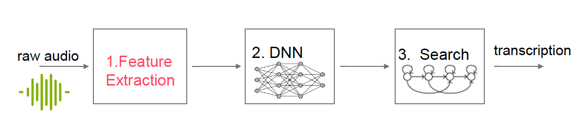

# Grundlagen Der Automatischen Spracherzeugung: 2024-ase-gruppe 777

## Content

This repository is based on the course [Grundlagen Der Automatischen Spracherzeugung](https://moseskonto.tu-berlin.de/moses/modultransfersystem/bolognamodule/beschreibung/anzeigen.html?number=41121&version=1&sprache=1) from the Technische Universität Berlin. The objective is to create a transcription from a raw audio signal. 

|  | 

## Getting started
